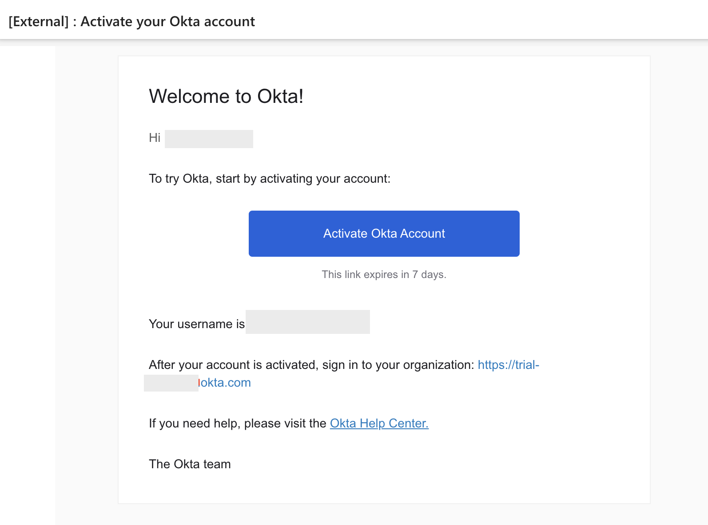

# Okta Account for Identity Federation


## Create Okta Account

1. Sign up for Okta account free trial account using the following link : 

    ```
    https://www.okta.com/free-trial/
    ``` 

    

2. Enter the details and click on **Start Free Trial** , then click on **Finish**

3. You will receive a Welcome email from Okta, Click on **Activate Okta Account**

    

4. Sign in to your Okta organisation using the URL provided by Okta in the Welcome email.

5. Click on **Admin** on the top right corner to access the admin console. **OR** use the following URL where **< okta-org >** is the prefix for your organization with Okta:

    ```
    https://<okta-org>-admin.okta.com
    ```

    

## Create a group

1. In the Admin Console, go to Directory and click on **Groups**.
2. Click **Add Group**.
3. Enter a name for the group in the Name field.
4. Click **Save.**

## Create a user

1. In the Admin Console, go to **Directory** and click on **People**.
2. Click **Add Person**.
3. Accept the default for user type
4. Add the following details:
    * First name: Enter the user's first name.
    * Last name: Enter the user's last name.
    * Username: Enter the user's username in email format.
    * Primary email: Enter the user's primary email if it's different from their username.
    * Groups: Select the group that you created in the previous step
    * Password: Select **Set by admin** and enter a password.
    * User must change password on first login: Deselect this checkbox to keep the password that you created for the user.
5. Accept the defaults for all other fields and Click **Save**

