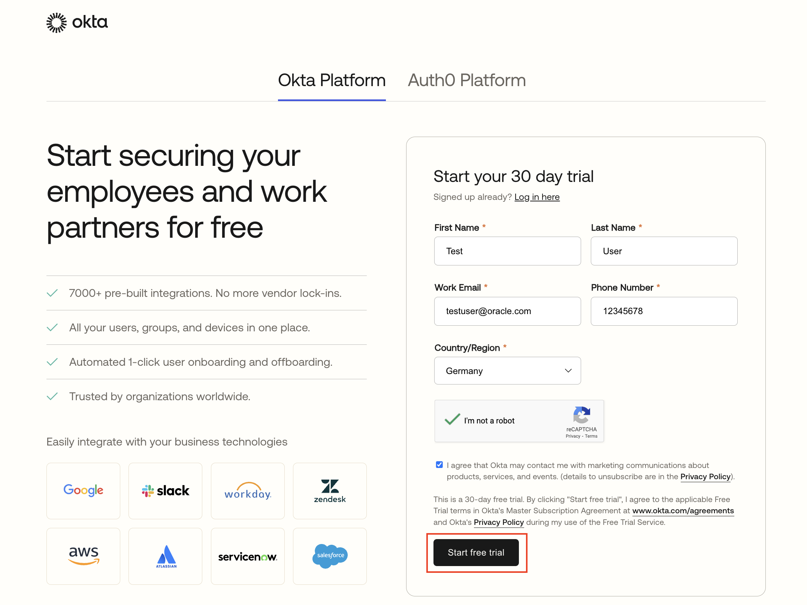

# Basic Setup

## Login to OPERA Cloud Identity Management Portal

* [Login as Non-Federated User](#login-as-non-federated-user)


## Login as Non-Federated User

1. To login as an end user to Opera Cloud Identity Management portal as a non-Federated user, Navigate to the Opera Cloud Identity Management portal URL which follows the following pattern

    ```
    https://<Host>/<CUSTOMER ENTERPRISE ID>/ocimportal
    ```

2. On the login screen  enter your Username and Password. Click Sign In
The Opera Cloud Identity Management portal home page appears.

3. You can review and edit your profile details within the Opera Cloud Identity Management portal. 


## Create Okta Account

1. Sign up for Okta account free trial account using the following link : 

```
    https://www.okta.com/free-trial/
``` 



2. 
