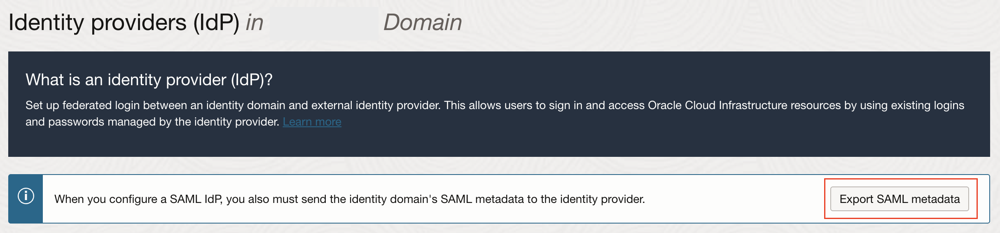

# OPERA Cloud Identity Management Federation with Microsoft Entra ID

## Prerequisites for Microsoft Entra ID Integration with OCIM

* Microsoft Entra ID account with subscription to enterprise license
* A user account in Microsoft Entra ID with permission to configure provisioning (for example, Application Administrator, Cloud Application Administrator, Application Owner, or Global Administrator).
* OPERA Cloud Identity Management’s OCI IAM Identity Domains provisioned for the customer.
* User account in OCI IAM Identity Domain with Administrator permissions.

## Task 1 : Create a confidential application in OCI IAM Identity Domain​

1. Open a supported browser and enter the following Console URL: 

    ```
    https://cloud.oracle.com
    ```
2. Enter your Cloud Account Name, also referred to as your tenancy name, and click Next.

3. Enter the login information and sign in to the OCI console. 

4. Open the navigation menu and click **Identity & Security**. Under Identity, click **Domains**.

     

5. Select the identity domain in which you want to configure Entra ID provisioning and click **Integrated Applications**.

6. Click **Add Application** and choose **Confidential Application** and then click **Launch workflow**.

    

7. Enter a name for the confidential application, for example, “AzureSync” Click Next.

8. Under Client configuration, select Configure this application as a client now. Under Authorization, select Client credentials

     

9. Scroll to the bottom and click Add app roles.

10. Under **App roles** click **Add roles**, and in the Add app roles page, select **User Administrator** and click **Add**.

    

    

11. Click Next and then click Finish.

12. On the application details page, click Activate and confirm that you want to activate the new application.

### Find the Domain URL and Generate a Secret Token

13. Return to the identity domain overview by clicking the identity domain name in the breadcrumbs. Click **Copy** next to the Domain **URL** in Domain information and save the URL to an app where you can edit it. 

14. Also note the OCI IAM GUID, which is the **IdentityDomainID** part of the domain URL:

    ```
    https://<IdentityDomainID>.identity.oraclecloud.com:443/fed/v1/idp/sso
    ```

    

14. In the confidential app in OCI IAM, click the OAuth configuration under Resources.

15. Scroll down and find the Client ID and Client secret under General Information.

16. Copy the client ID and store it.

    

17. Click Show secret and copy the secret and store it.

    
    
18. The secret token is the base64 encoding of clientID:clientsecret or

    ```
    base64(<clientID>:<clientsecret>)
    ```

The following examples show how to generate the secret token on Microsoft Windows and Apple MacOS.

In a Microsoft Windows environment:

* Open CMD and use this powershell command to generate base64:

    ```
    [Convert]::ToBase64String([System.Text.Encoding]::Unicode.GetBytes('client_id:secret'))
    ```
* Make a note of the secret token value.

In an Apple MacOS, use the following:

* Open terminal and use the following command

    ```
    echo -n <clientID>:<clientsecret> | base64
    ```
    
* Make a note of the secret token value.

## Task 2 : Configure the OCI IAM Application in the Identity Provider (Microsoft Entra ID)​

1. Sign into Microsoft Azure using the following URL:

    ```
    https://portal.azure.com
    ```
2. Click **Microsoft Entra ID** to open the Entra ID  Overview page.

    

3. In the navigation menu on the left, click **Enterprise applications**

4. On the Enterprise applications page, click New application.
Search for Oracle Cloud Infrastructure Console and select it.

    

5. Enter a name or accept the default name - Oracle Cloud Infrastructure Console. Click **Create**.

    

6. Open the enterprise application that you just created. On the Application Overview page, Select **Provisioning**  from the navigation menu on the left under Manage
    
    

7. Click Get started:

    * Change the Provisioning Mode to **Automatic**.
    
    * Under Admin Credentials, Enter the **Tenant URL**. The tenant URL is the OCI IAM Domain URL noted in the previous steps followed by **/admin/v1** 
    That is, the tenant URL will be in the following format : 
        ```
        https://<domainURL>/admin/v1
        ```
    * Enter the base 64 encoded secret token generated in the previous steps.

    

10. Click Test Connection and verify if the test is successful. Then click **Save**


## Task 3 : Configure Provisioning and User Attribute Mappings in the Identity Provider (Entra ID)

1. Go back to the application overview page of the enterprise application you created earlier.

2. In the left navigation menu under Manage, click **Provisioning** and then click **Edit Provisioning**.

3. In the Provisioning page, click **Mappings**.
Under Mappings, click **Provision Microsoft Entra ID Users**

    

    The **Attribute Mapping** page is opened.

### Custom Attribute Mapping

To add mapping for target attributes, such as custom attributes and attributes not defined by default in the provisioning connector schema, you can edit the JSON representation of the schema to add these attribute mappings.

4. Open a **new browser tab** and navigate to the following URL:

    ```
    https://portal.azure.com/?Microsoft_AAD_Connect_Provisioning_forceSchemaEditorEnabled=true
    ```

   > [!NOTE]
   > Editing the list of supported attributes is only recommended for administrators who have customized the schema of their applications and systems and have first-hand knowledge of how their custom attributes are defined or if a source attribute is not automatically displayed in the Microsoft Entra admin center UI. This sometimes requires familiarity with the APIs and developer tools provided by an application or system. The ability to edit the list of supported attributes is locked down by default, but but customers can enable this capability by navigating to the above URL

5. Navigate to the enterprise application that you created. In the left navigation menu under Manage, click **Provisioning** and then click **Edit Provisioning**.

6. In the Provisioning page, click **Mappings**.
Under Mappings, click **Provision Microsoft Entra ID Users**

7. Select the **Show advanced options** check box at the bottom of the Attribute Mapping screen, and then select **Edit attribute list for OracleIDCS**.

    

8. Add the following custom attribute:

    * Name: 
        ```
        urn:ietf:params:scim:schemas:idcs:extension:custom:User:OC_PrimaryWorkLocation
        ```
    * Type: **String**

        


**Optional Step** : You can also add other custom attributes by referring to the User Attribute Table mentioned [here](https://docs.oracle.com/en/industries/hospitality/identity-management/24.3/ocima/t_additional_config_federated_users.htm)

9. Click **Save** 

10. In the Provisioning page, click **Mappings**.
Under Mappings, click **Provision Microsoft Entra ID Groups**

11. Select the **Show advanced options** check box at the bottom of the Attribute Mapping screen and then select **Edit attribute list for OracleIDCS.**

12. Add the Group description attribute:

    * Name: 
        ```
        urn:ietf:params:scim:schemas:oracle:idcs:extension:group:Group:description
        ```
    * Type: **String**

13. Click **Save** and **Close the browser tab**

14. Go back to the browser tab in which **Attribute Mapping** page was opened (Task 3, Step 3).

15. Click on **Add Mapping**. 

    To Add a mapping, Refer to the **User Mapping table** and enter the following details:

    * Mapping type : Refer to value from the **Mapping Type** column from the User Mapping Table
    * Value/Expression : Refer to the **Value** column from the User Mapping Table
    * Target Attribute: Refer to the value from the **OCI IAM Domain User Attribute Name** column from the User Mapping Table
    
    The User Mapping table to map user attributes between OCI IAM and Entra ID is shown below. Ensure all of the mandatory attributes are added. Some attributes may have already been created by default, you do not have to add them.

    | Entra ID User Attribute Name     | OCI IAM Domain User Attribute Name | IAM Domain Attribute Type | Mapping Type | Attribute Value | Description | Mandatory Attribute |
    | ----------- | ----------- |-------|------|------|------|--------|
    |userPrincipalName|userName|String|Direct|N/A|User name|Yes|
    |surname|name.familyName|String|Direct|N/A|Last name|Yes|
    |mail|emails[type eq "work"].value|String|Direct|N/A|Email address|Yes|
    |       | urn:ietf:params:scim:schemas:idcs:extension:custom:User:OC_PrimaryWorkLocation|    String   | Constant | <ENTERPRISE_ID >:E or <CHAINCODE>:C | Mandatory Single Valued User Attribute. Indicates the User’s primary work location. Primary Work Location can have values <ENTERPRISE_ID >:E for multi-chain customers derived from the User profile. For customers having only a single chain, the source value can be set to constant <CHAINCODE>:C for all users.| Yes|
    |CBool(true)|urn:ietf:params:scim:schemas:oracle:idcs:extension:user:User:isFederatedUser|Boolean|Expression|CBool("true")|Enable Federated User flag in Identity Domain.|Yes|
    |CBool(true)|urn:ietf:params:scim:schemas:oracle:idcs:extension:user:User:bypassNotification|Boolean|Expression|CBool("true")|The bypass notification flag controls whether an email notification is sent after creating or updating a user account in Identity Domain. The bypassNotification must be set to "true" for Federated users. This disables user account activation notification in IAM Identity Domain for the user.|Yes|
    |active|active|String|Expression|Not([IsSoftDeleted])|User status. The attribute IsSoftDeleted is often part of the default mappings for an application in Entra ID. It is not recommended to remove the IsSoftDeleted attribute from your attribute mappings.|Yes|

    Optionally, you can also add other optional attributes by referring to the User Attribute Table mentioned [here](https://docs.oracle.com/en/industries/hospitality/identity-management/24.3/ocima/t_additional_config_federated_users.htm)

16. Click **Save**

### Group Attribute Mapping

17. On the Provisioning page, click Mappings.
18. Under Mappings, click **Provision Microsoft Entra ID Groups**. Refer to the below table to update and add the mappings for Group attributes.

    | Entra ID User Attribute Name     | OCI IAM Domain User Attribute Name | IAM Domain Attribute Type | Mapping Type | Attribute Value | Description | Mandatory Attribute |
    | ----------- | ----------- |-------|------|------|------|--------|
    |displayName|displayName|String|Direct|N/A|Group display name|Yes|
    |members|members|String|Direct|N/A|Members of the group|No|
    |objectId|externalId|String|Direct|N/A|External Group Id|No|
    |description|urn:ietf:params:scim:schemas:oracle:idcs:extension:group:Group:description|String|Direct|N/A|Group description|No|

19. Click **Save**

20. Navigate to **Provision Microsoft Entra ID Groups** and add the mapping for the Group description and save the changes.

21. Select **Provisioning** from the left navigation menu and set the **Provisioning Status** to “On”

22. Save the changes.
    

## Task 4 : Test User and Group Provisioning into OCI IAM

1. In Entra ID, in the left navigation menu, click Enterprise applications.

2. Click the enterpise application you created earlier.

3. In the left menu under Manage, click **Users and groups.**

4. In the Users and groups page, click **Add user/group.**

5. On the Add Assignment page, under Users and groups, click **None Selected.** The Users and groups page opens.

6. Select one or more users or groups from the list by clicking them. The ones you select are listed under Selected items.

     

7. Click Select. The number of users and groups selected are shown on the Add Assignment page.

    

8. On the Add Assignment page, click Assign.
The Users and groups page now shows the users and groups you have chosen.

    

9. Click Provisioning in the left menu to see the provisioning details for the groups and users. The provisioning log shows the status.

    

10. When provisioning is successful, the Current cycle status indicates that the incremental cycle has completed, and the number of users provisioned to OCI IAM appears.

    

    In OCI IAM, you can now see the users and groups provisioned from Entra ID.

    


## Task 5 : Configure Single Sign On (SAML) settings ​in the Identity Provider (Microsoft Entra ID)

### Download the SAML Metadata in OCI IAM Identity Domain

1. Log in to Oracle IAM Domain Admin Console.
2. Open the navigation menu and click Identity & Security.
3. Under Identity, click Domains.
4. Click the name of the identity domain in which you want to work.
5. Click Security on the left navigation and then click **Identity providers.**
6. Click **Export SAML metadata.**
    
7. Select **Download XML** under Metadata with self-signed certificates.
    

### Configure SSO for the Enterprise application in Entra ID

8. Under the Manage section, select **Single sign-on**

    

2. Select **SAML** to configure the single sign-on. The Set up Single Sign-On with SAML page appears.
3. At the top of the page, click **Upload metadata file.**

    

4. Locate the federation metadata file (metadata.xml) you downloaded from Oracle Cloud Infrastructure in Step 1 and upload it here. 
After you upload the file, the following Basic SAML Configuration fields are automatically populated:
    * Identifier (Entity ID)
    * Reply URL (Assertion Consumer Service URL)

5. In the **Basic SAML Configuration** section, click Edit. On the Basic SAML Configuration pane, enter the following required information:

    * Sign on URL:
        * Enter the OPERA Cloud User Interface URL for your OPERA Cloud Environment if you have a single OPERA Cloud environment.
        
            For example: https://customerocua.oraclehospitality.eu-frankfurt-1.ocs.oraclecloud.com/IDENTITY/operacloud/ where IDENTITY is the ENTERPRISE ID of the customer.

        Or

        * Enter the OPERA Cloud Identity Management Portal URL if you have multiple OPERA Cloud environments.
        
            For example: https://ocimqa.oraclehospitality.us-phoenix-1.ocs.oraclecloud.com/IDENTITY/ocimportal/ where IDENTITY is the ENTERPRISE ID of the customer.

        

6. Click **Save**

### Configure User Attributes and Claims in Azure

The Oracle Cloud Infrastructure Console enterprise application template in Entra ID is seeded with the required attributes, so there is no need to add any. However, you must make the following customizations:

14. In the User Attributes & Claims section, click Edit in the upper-right corner. The Manage Claim panel appears.
2. Next to the Name identifier value field, click Edit.
3. Under Required claim, select **Unique User Identifier (Name ID).**
4. Select **Email address** and change it to “Persistent.”
5. For Source, select **Attribute.**
6. For Source attribute, select **user.userprincipalname**

    

7. **Optional Step** : Configure additional claims by referring to the SAML Attribute Mapping table [here](https://docs.oracle.com/en/industries/hospitality/identity-management/24.3/ocimc/t_step4_configure_user_attributes_claims.htm) 
**Note:** Only oc_primaryworklocation is mandatory. Other additional claims are optional.

### Download the Entra ID SAML Metadata Document

21. In the SAML Signing Certificate section, click the download link next to Federation Metadata XML.

2. Download this document and make a note of where you save it. You will upload this document to the IAM Domain Console in the next series of steps.

### Assign User Groups to the Application

23. On the left navigation pane, under Manage, select Users and Groups.
2. Click Add at the top of the Users and Groups list to open the Add Assignment pane.
3. Click the Users and groups selector.
4. Enter the name of the group you want to assign to the application into the Search by name or email address search box.
5. Hover over the group in the results list to see a check box appear. Select the check box to add the group to the Selected list.
6. When you are finished selecting groups, click Select to add them to the list of users and groups to be assigned to the application.
7. Click Assign to assign the application to the selected groups.


## Task 6 :  Configure Entra ID as an Identity Provider in OCI IAM Identity Domain

1. Navigate to the Oracle IAM domain console.
2. On the navigation menu, click Security and then click Identity providers.
3. Click Add IdP and then click Add SAML IdP.
4. Enter the following information:
    * **Name:** Enter the name of the IdP.
    * (Optional) **Description:** Enter a description of the IdP.
    * (Optional) **Identity provider icon:** Drag and drop a supported image or click select one to browse for the image.
5. Click Next.
    Ensure that Import identity provider metadata is selected, and browse and select, or drag and drop the Entra ID metadata XML file into Identity provider metadata. This is the metadata file you saved earlier from Entra ID.
6. Click Next.
7. In Map user identity, set the values as shown in the following screenshot
    

8. Click Next.
9. Under Review and Create, verify the configurations, and then click **Create IdP.**
10. Click **Activate.**

## Task 7 : Configure Identity Provider (IdP) Policy​

1. Click **Add to IdP Policy Rule.**
12. Click **Default Identity Provider Policy** to open it, and from the context (three dots) menu choose **Edit IdP rule**
13. Click **Assign identity providers** and then click **Entra ID Identity provider** to add it to the list.
14. Click Save Changes.

## Task 8 : Configure Single Sign-on Policy​

1. Go back to Security and click **Sign-on policies.**
16. Click **Default Identity Provider** Policy to open it, and in the Sign-on rules from the context (three dots) menu on the right, select **Edit IdP rule.**
17. Select Entra ID
    

18. Save your changes.


## Task 9 - Test Single Sign-on

1. Enter the OPERA Cloud Console URL which follows the following format:
    ```
    https://<hostname>/<enterprise Id>/operacloud
    ```

2. On the sign-in page, you can see an option to sign in with Entra ID.
3. Select Entra ID. You are redirected to the Microsoft login page.
4. Provide your Entra ID credentials.
5. On successful authentication, a ‘Connection Successful’ message appears.
6. You are now signed in to the OPERA Cloud Console using Entra ID single sign-on.

