# OPERA Cloud Identity Management Federation with Okta <!-- omit from toc -->
- [1. Create a confidential application in OCI IAM Identity Domain​](#1-create-a-confidential-application-in-oci-iam-identity-domain)
  - [1.1. Find the Domain URL and Generate a Secret Token](#11-find-the-domain-url-and-generate-a-secret-token)
- [2. Configure the OCI IAM Application in the Identity Provider (Okta)​](#2-configure-the-oci-iam-application-in-the-identity-provider-okta)
- [3. Configure Provisioning and User Attribute Mappings in the Identity Provider (Okta)](#3-configure-provisioning-and-user-attribute-mappings-in-the-identity-provider-okta)
- [4. Test User and Group Provisioning into OCI IAM](#4-test-user-and-group-provisioning-into-oci-iam)
- [5. Configuring Single Sign-on](#5-configuring-single-sign-on)
  - [5.1. Download the SAML Metadata from OCI IAM Identity Domain](#51-download-the-saml-metadata-from-oci-iam-identity-domain)
  - [5.2. Configure Single Sign On (SAML) settings ​in the Identity Provider (Okta)](#52-configure-single-sign-on-saml-settings-in-the-identity-provider-okta)
- [6. Configure Okta as an Identity Provider in OCI IAM Identity Domain](#6-configure-okta-as-an-identity-provider-in-oci-iam-identity-domain)
- [7. Configure Identity Provider (IdP) Policy​](#7-configure-identity-provider-idp-policy)
- [8. Configure Single Sign-on Policy​](#8-configure-single-sign-on-policy)
- [9. Test Single Sign-on](#9-test-single-sign-on)

## Prerequisites for Okta Integration with OCIM <!-- omit from toc -->

* An Okta account with administrator privileges.
* User account in OCI IAM Identity Domain with Administrator role.
  
## Objectives <!-- omit from toc -->

* The objective of this lab is to configure Okta as the Identity Provider for OPERA Cloud Identity Management.   

* You will learn to setup synchronization of users, groups and their group memberships from Okta to OPERA Cloud Identity Management.    

* You will also setup Single Sign-on to access OPERA Cloud with Okta credentials.

## 1. Create a confidential application in OCI IAM Identity Domain​

1. Open a supported browser and enter the following Console URL: 

    ```
    https://cloud.oracle.com
    ```
>> Note: Oracle Cloud Infrastructure supports the latest  versions of Google Chrome, Microsoft Edge, Safari and Firefox.


2. Enter your Cloud Account Name, also referred to as your tenancy name, and click Next.

3. Enter the login information and sign in to the OCI console. 

4. Open the navigation menu and click **Identity & Security**. Under Identity, click **Domains**.

     

5. Select the identity domain in which you want to configure Okta provisioning and click **Integrated Applications**.

6. Click **Add Application** and choose **Confidential Application** and then click **Launch workflow**.

    

7. Enter a name for the confidential application, for example, “OktaSync” Click Next.

8. Under Client configuration, select Configure this application as a client now. Under Authorization, select Client credentials

     

9. Scroll to the bottom and click Add app roles.

10. Under **App roles** click **Add roles**, and in the Add app roles page, select **User Administrator** and click **Add**.

    

    

11. Click Next and then click Finish.

12. On the application details page, click Activate and confirm that you want to activate the new application.

### 1.1. Find the Domain URL and Generate a Secret Token

13. Return to the identity domain overview by clicking the identity domain name in the breadcrumbs. Click Copy next to the Domain URL in Domain information and save the URL to an app where you can edit it. The OCI IAM GUID is the **IdentityDomainID** part of the domain URL:

    ```
    https://<IdentityDomainID>.identity.oraclecloud.com:443/fed/v1/idp/sso
    ```

    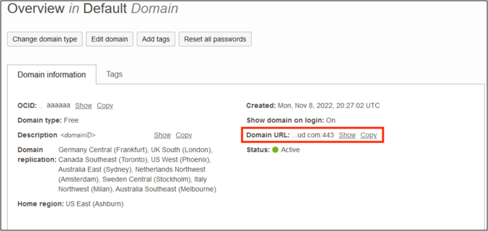

14. In the confidential app in OCI IAM, click the OAuth configuration under Resources.

15. Scroll down and find the Client ID and Client secret under General Information.

16. Copy the client ID and store it.

    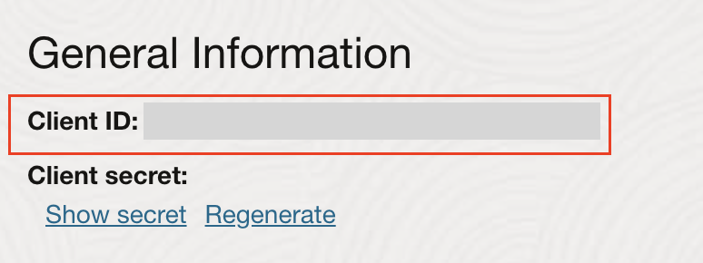

17. Click Show secret and copy the secret and store it.

    
    
18. The secret token is the base64 encoding of clientID:clientsecret or

    ```
    base64(<clientID>:<clientsecret>)
    ```

The following examples show how to generate the secret token on Microsoft Windows and Apple MacOS.

In a Microsoft Windows environment:

* Open CMD and use this powershell command to generate base64:

    ```
    [Convert]::ToBase64String([System.Text.Encoding]::Unicode.GetBytes('client_id:secret'))
    ```
* Make a note of the secret token value.

In an Apple MacOS, use the following:

* Open terminal and use the following command

    ```
    echo -n <clientID>:<clientsecret> | base64
    ```
    
* Make a note of the secret token value.

## 2. Configure the OCI IAM Application in the Identity Provider (Okta)​

1. Sign in to your Okta account.

2. Click on **Admin** on the top right corner to access the admin console. **OR** use the following URL where **< okta-org >** is the prefix for your organization with Okta:

    ```
    https://<okta-org>-admin.okta.com
    ```

    

3. From the navigation menu on the left, Click **Applications** , then Click **Browse App Catalog**

     

4. Search for **Oracle Cloud Infrastructure IAM** and select it. Click **Add Integration**

    

    

5. Under General settings, enter a name for the application, for example **OCI-App**, and click **Done**.


## 3. Configure Provisioning and User Attribute Mappings in the Identity Provider (Okta)

1. In the newly created application page, click the **Sign On** tab.
In Settings, click **Edit**.

      

2. Scroll down to Advanced Sign-on Settings.
Enter the OCI IAM GUID (Identity Domain ID) that you saved earlier from the Domain URL. Click **Save**

     

3. Scroll to the top and click the Provisioning tab. Click Configure API Integration.

     

4. Select Enable API Integration. Enter the secret token value you copied earlier in API Token.

     

5. Click Test API Credentials.
If you get an error message, check the values that you have entered and try again.

    Okta has successfully connected to the OCI IAM SCIM endpoint when you get the ‘Oracle Cloud Infrastructure IAM was verified successfully!’ message.

6. Click Save.
    
    The Provisioning to App page opens, where you can create users, update user attributes, and map attributes between OCI IAM and Okta.

7. Under Settings, select **To App**, then Click **Edit**.

     

8. Enable Create Users, Update User Attributes & Deactivate Users. Click Save.

     

9. Scroll down to the Attribute Mappings section. Click **Go to Profile Editor**; the Attribute section lists OCI IAM Attributes.

    

10. Click on **Add Attribute** 
    

    
    To Add an attribute, Refer to the User Mapping table and enter the following details:

    * Data type : Refer to value from the **Mapping Type** column from the User Mapping Table
    * Display name : Refer to the value from the **IAM Domain (IDCS) User Attribute** column from the User Mapping Table
    * Variable name: Refer to the value from the **IAM Domain (IDCS) User Attribute** column from the User Mapping Table
    * External name : Automatically populated by the value of the variable name.
    * External namespace : Refer to the value from the **External Namespace** column from the User Mapping Table. If there is no value in the column, leave it blank.
    * Attribute type : Select **Personal**

    
    The User Mapping table to map user attributes between OCI IAM and Okta is shown below. Ensure all of the mandatory attributes. Some attributes may have already been created by default, you do not have to add them.

    

    | Okta Attribute      | IAM Domain (IDCS) User Attribute | External Namespace | Mapping Type | Attribute Value | Description | Mandatory Attribute |
    | ----------- | ----------- |-------|------|------|------|--------|
    | login      | userName       | | Direct| Map from Okta profile | User name| Yes|
    | lastName   | name.familyName | | Direct| Map from Okta profile| Last name| Yes|
    |email| emails[type eq "work"].value| | Direct| Map from Okta profile| Email address| Yes |
    |(user.email != null && user.email != '') ? 'work' : ''| emailType| | string| (user.email != null && user.email != '') ? 'work' : '' | Email Type| Yes |
    |extensionAttributePrimaryWorkLocation| OC_PrimaryWorkLocation | urn:ietf:params:scim:schemas:idcs:extension:custom:User | string | Same value for all Users. Refer description | Mandatory Single Valued User Attribute. Indicates the User primary work location. Primary Work Location can have values <CHAINCODE>:C for multi chain customers derived from the User profile. For customers having only a single chain, the source value can be set to constant <CHAINCODE>:C for all users. | Yes |
    | isFederatedUser| isFederatedUser | urn:ietf:params:scim:schemas:oracle:idcs:extension:user:User| boolean | true | Enable Federated User flag in Identity Domain.| Yes|
    |bypassNotification|bypassNotification|urn:ietf:params:scim:schemas:oracle:idcs:extension:user:User| boolean | true | The bypass notification flag controls whether an email notification is sent after creating or updating a user account in Identity Domain. The bypassNotification must be set to "true" for Federated users. This disables user account activation notification in IAM Identity Domain for the user. | Yes | 

    See the following example to add the 'OC_PrimaryWorkLocation' attribute:

    

11. Once all the mandatory attributes have been created, click **Mapping**. Click on the tab **Okta User to OCI App**

    

    

12. Refer to the the **User Mapping** table again and enter the values from the **Attribute Value** column. 
Note: Use single quotes ('') for string values, for example primary work location. Save the mappings.

     

13. Syncing Groups from Okta to Oracle Identity Domain can be done manually or can be automated by selecting the **Push Group** tab under the OCI IAM application to define a rule.

    Select the Push Group tab and click on **Push Group**

    

14. Click on **Find groups by name** and Enter the group name to push from Okta to OCI IAM Domain. Then click **Save**

    


## 4. Test User and Group Provisioning into OCI IAM 

1. In the newly created application, click the Assignments tab.
2. Click Assign and select Assign to People.

    

3. Search for the user to provision from Okta to OCI IAM.

4. Click Assign next to the user. For example, here we are assigning "test user1" to provision from Okta to OCI

    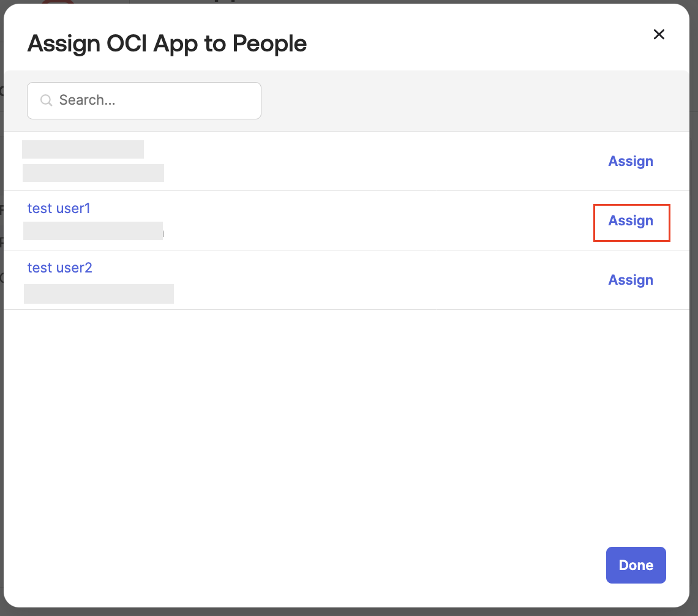

5. Click Save and then click Go Back.

6. Now provision Okta groups into OCI IAM. In the Assignments tab, click Assign and select Assign to Groups.

7. Search for the groups to be provisioned to OCI IAM. Next to the group name, click Assign.

    

8. Click Done.

9. Open a supported browser and enter the following Oracle Cloud Infrastructure (OCI) Console URL: https://cloud.oracle.com and sign in to the OCI console

10. Open the navigation menu and click **Identity & Security**. Under Identity, click **Domains**

11. Select the identity domain in which Okta has been configured.
Click Users.
The user which was assigned to the OCI IAM application in Okta is now present in OCI IAM.
Click Groups.
The group which was assigned to the OCI IAM application in Okta is now present in OCI IAM.

    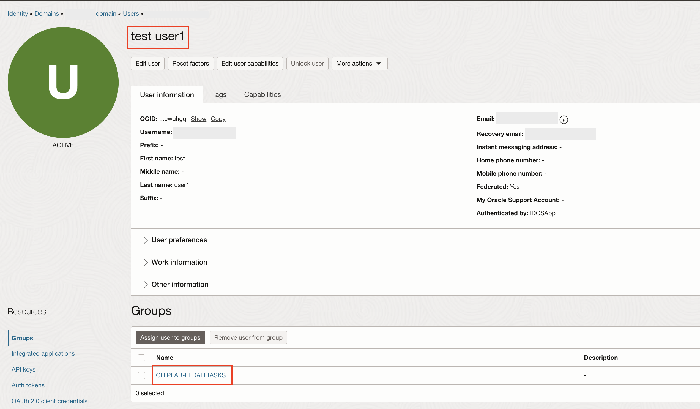

## 5. Configuring Single Sign-on

### 5.1. Download the SAML Metadata from OCI IAM Identity Domain

1. Open a supported browser and enter the following Oracle Cloud Infrastructure (OCI) Console URL: https://cloud.oracle.com and sign in to the OCI console

2. Open the navigation menu and click **Identity & Security**. Under Identity, click **Domains**

3. Select the identity domain in which Okta has been configured. 

4. Next, click Security and then click Identity providers.

5. Click **Export SAML metadata**

    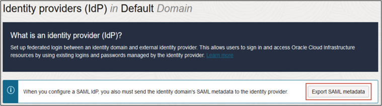

6. Select the Metadata file option and click **Download XML**

    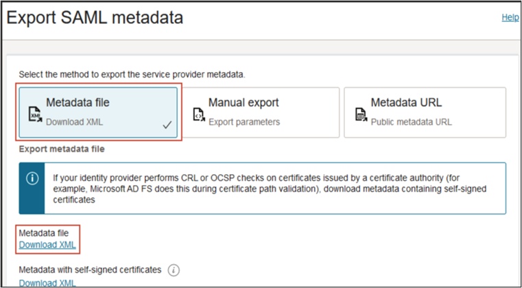

7. Return to the identity domain overview by clicking the identity domain name in the breadcrumb navigation trail. Click Copy next to the Domain URL in Domain information and save the URL. This is the OCI IAM domain URL that you will use later.

### 5.2. Configure Single Sign On (SAML) settings ​in the Identity Provider (Okta)

8. In the Okta admin console, Click on Applications under the navigation menu and go to the application that was previously created for provisioning.
Note: You can also create a new application for SSO optionally.

2. In the application details page of the application, click the **Sign On** tab

3. Click on **More Details** and make note of the following:

    * Sign on URL
    * Issuer

    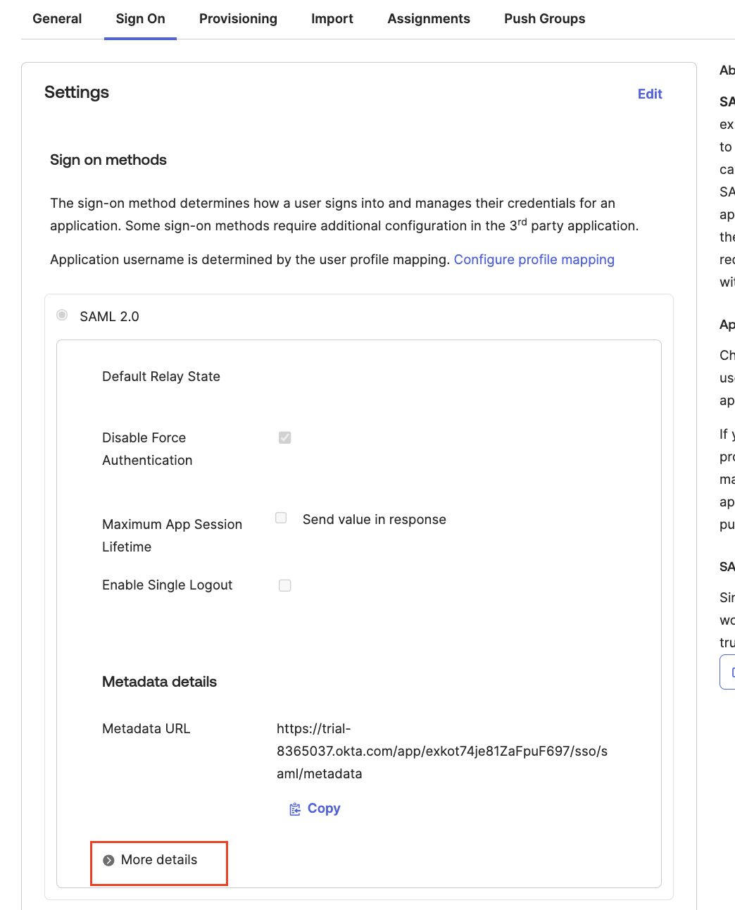

4. Click on Download next to the Signing Certificate and save as '.pem' file

    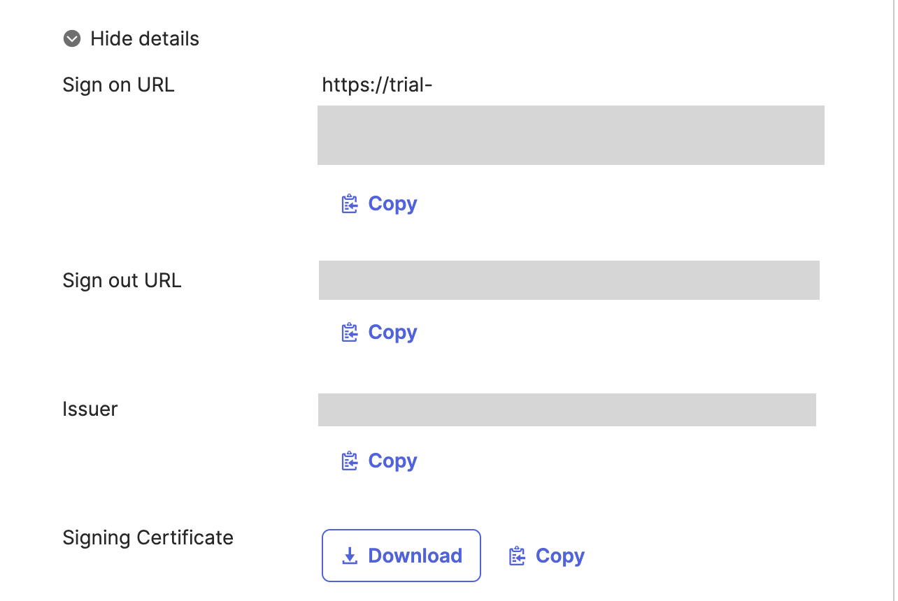


## 6. Configure Okta as an Identity Provider in OCI IAM Identity Domain

1. In the OCI Console in the domain you are working in, click Security and then click Identity providers.

2. Click Add IdP and then click Add SAML IdP.

3. Enter a name for the SAML IdP, for example, Okta. Click Next.

4. On the Exchange metadata page, ensure that **Enter IdP metadata** is selected.

5. Enter the following details that was noted in the previous steps
    * For Identity provider issuer URI: Enter the Issuer URL.
    * For SSO service URL: Enter the SingleSignOnService URL.
    * For SSO service binding: Select POST.
    * For Upload identity provider signing certificate: Use the .pem file of the Okta certification.

    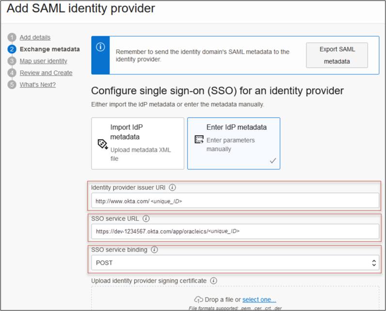

6. On the Map attributes page:
    * For Requested NameId format, choose None.
    * For Identity provider user attribute: Choose SAML assertion Name ID.
    * For Identity Domain user attribute: Choose UserName.
7. Click Next. Review and click Create IDP.
8. On the What's Next page, click Activate
9. Click Service Provider metadata.
10. Click Download next to Service Provider signing certificate to download the SP signing certificate and save it.

## 7. Configure Identity Provider (IdP) Policy​

1. In the OCI Console in the domain you are working in, click Security and then click IdP policies.

2. Click Default Identity Provider Policy and edit the Default IDP Rule

    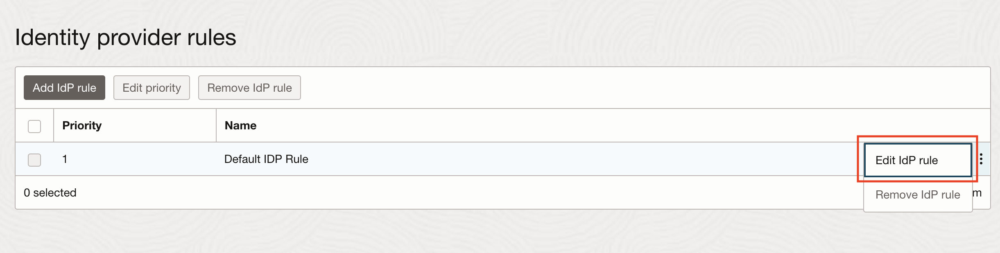

3. Under Assigned Identity Providers, add the IdP that was created for Okta and Save your changes.

    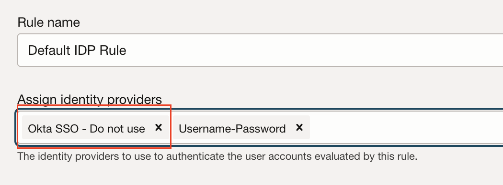

## 8. Configure Single Sign-on Policy​

1. Add IdP to Sign-on policy in IAM Domain:
    * Navigate to Sign-on policies under Security.
    * Click on Default Sign-On Policy.
    * Under Sign-on rules, edit the Default Sign-On Rule.
        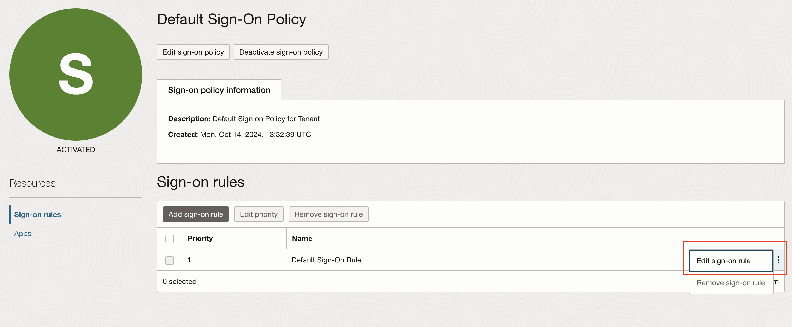

    * Under **Authenticating identity provider**, add the **Okta Identity Provider**. 
    **Note**: Do not remove any already existing Authenticating identity providers.

        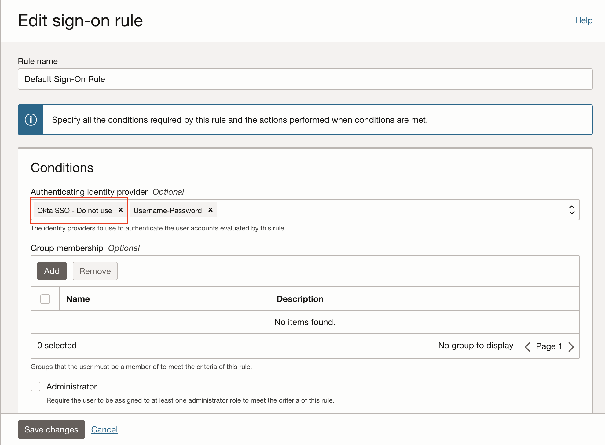


    

## 9. Test Single Sign-on

1. Enter the OPERA Cloud Console URL which follows the following format:
    ```
    https://<hostname>/<enterprise Id>/operacloud
    ```
2. You should see an option to sign in via **Okta IdP**. Click on the Okta IdP to sign-on

3. Sign in with the Okta credentials for the test user created during our setup

4. You are now signed in to the OPERA Cloud Console using Okta single sign-on.


