# OCIM Portal Administrator Journey – Group Management <!-- omit from toc -->

- [Objectives](#objectives)
- [Task 1 - Create a Custom Group](#task-1---create-a-custom-group)
- [Task 2 - Assign User to Custom Group](#task-2---assign-user-to-custom-group)
- [Task 3 - Revoke group membership​](#task-3---revoke-group-membership)
- [Task 4 - Copy Custom Groups](#task-4---copy-custom-groups)
- [Task 5 - Delete a Custom Group](#task-5---delete-a-custom-group)

## Objectives

* The objective of this lab is to understand group management in OCIM portal. 
* You will learn how to create a custom group, assign users to groups, revoke membership and delete a custom group.
* You will also learn how to copy groups from one location to another.

## Task 1 - Create a Custom Group

1. Click the **Groups** tile on the home page of the OPERA Cloud Identity Management Portal.

2. Click the **Create Group** button on the Group Management page.

3. Enter the custom Group Name.

4. Select a location from the location list of values.

      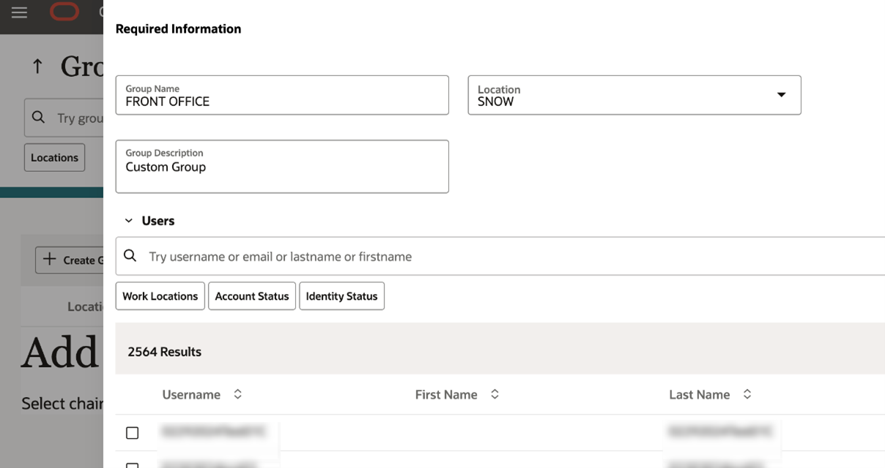

5. Click **Submit** to create the custom group.

## Task 2 - Assign User to Custom Group

1. Click the **Groups** tile on the home page of the OPERA Cloud Identity Management Portal.

2. To search groups, click on the location filterchip and select the location where the group was created.

3. Click the Group Name for example **FRONT_OFFICE** to open the group profile page.

    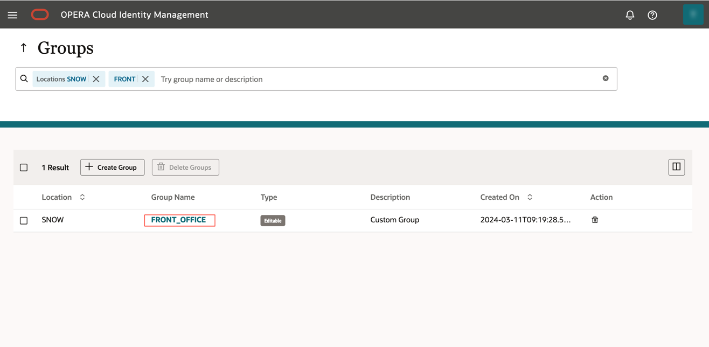

4. Click Edit Group to edit the group description.

5. Click **Assign Users** to assign user group membership in the group. 

    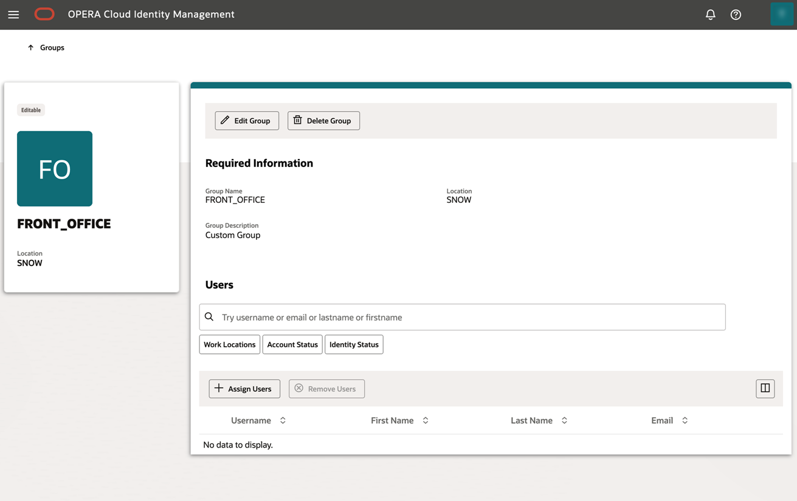

5. Select any user and click **Update** to assign the group membership.

## Task 3 - Revoke group membership​

1. Select a user in the group membership table and click the Remove Users button to delete that user group membership.

## Task 4 - Copy Custom Groups

1. Log in to OPERA Cloud Identity Management Portal as an Enterprise, or chain administrator.

2. Click the Tools tile on the homepage.
    Note: Only enterprise and chain level administrators have access to the Tools tile

     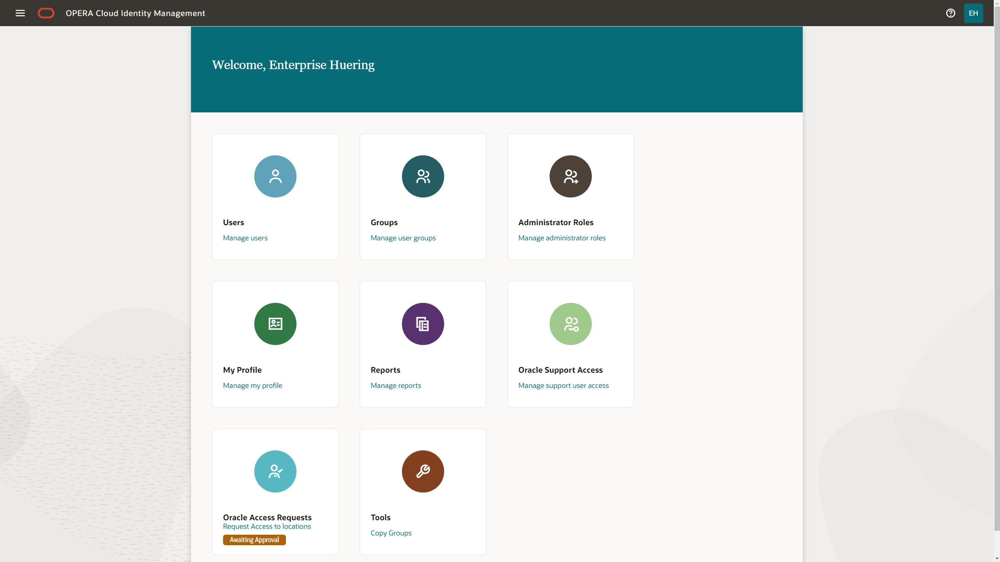

3. Select **Copy Groups To Additional Locations**. On the right hand-side, you will see a form with the required details to copy groups from one location to one or multiple other locations.

     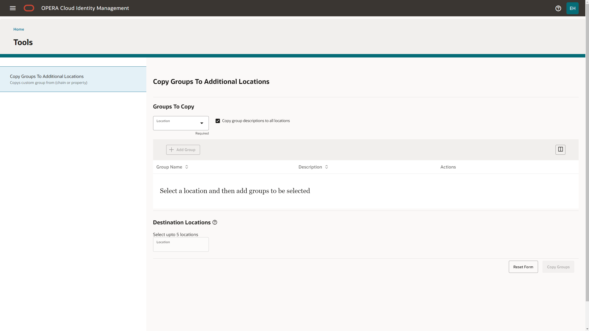

4. Configure groups to copy
    * Select the source location from the **Groups to Copy** section. You can select any chain or property location from the domain that you have administrative access to. Only one location selection is allowed.
    * You have the option to exclude the group descriptions from the copy process. Uncheck the checkbox beside "Copy group descriptions to all locations" to exclude the groups descriptions to be copied. By default, this checkbox is checked and groups descriptions from the source location will be copied to the destination locations.

        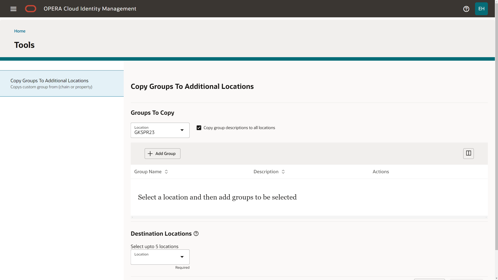

5. Add groups to be copied
    * After you selected the source location for the groups, you can select one or multiple groups and add these to be copied.
    Note: A maximum of 20 groups can be selected.

    * Select "Add Groups" to add the selected groups to be copied.

        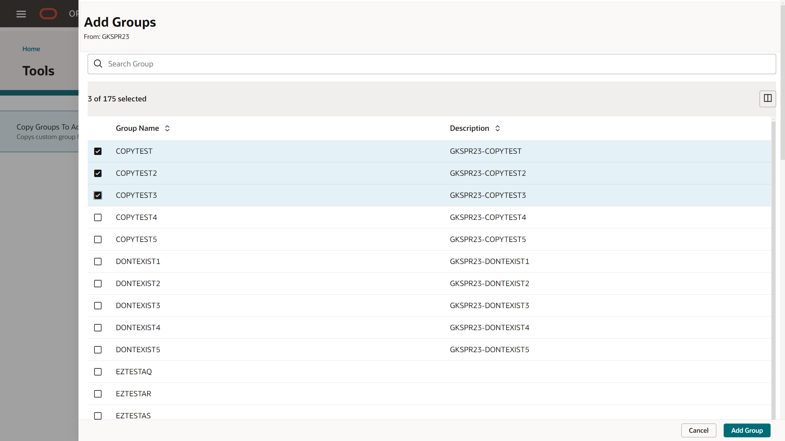

6. Review and edit selected groups
    * After you selected "Add Groups", the selected groups will be shown on the Copy Groups main page to be included in the copy process.
    * You can edit the selection of groups by selecting "Edit Groups" to add/remove groups

        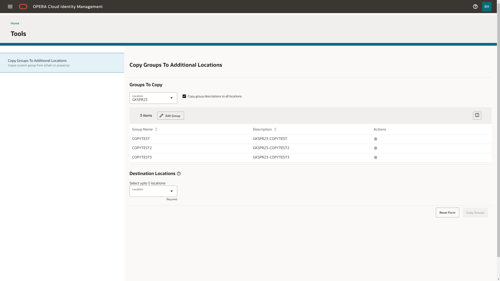

7. Select the destination locations
    * After you have selected and reviewed the groups to be copied, you can select up to 5 destination locations.
    Note: You can only copy groups from one location type to the same location type (i.e. copy chain groups to other chain locations and copy property groups to other property locations.) The available destination locations will only show the same type locations as selected in the source location.

        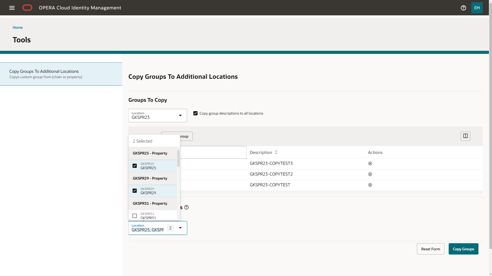

8. Copy groups process
    * After you selected the destination locations, you can select "Copy Groups" to copy the selected groups from the selected location to the destination locations.
    * After the process completes, you will see information banners that show the successfully copied location/group combinations and also shows any location/group combinations that could not be created in the destination location (i.e. a group with the same name already existed int he destination location).
    * The selected values from the copy group process will still show after the copy process completed to allow you to select other destination locations and repeat the process with the previously selected groups.
    * You can reset the form by selecting "Reset form" which will remove all selected details from the copy groups page.

        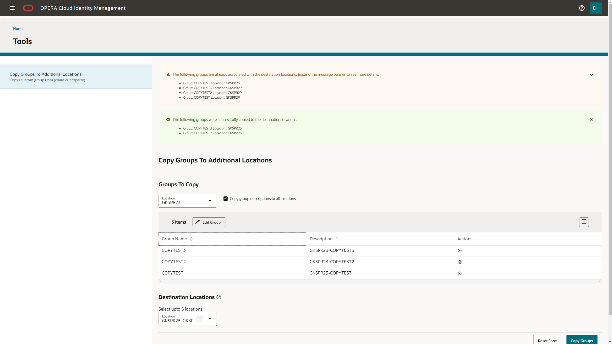

## Task 5 - Delete a Custom Group

1. Search for groups on the Group page.
2. Select group(s) and click the Delete Groups button to delete the group.
    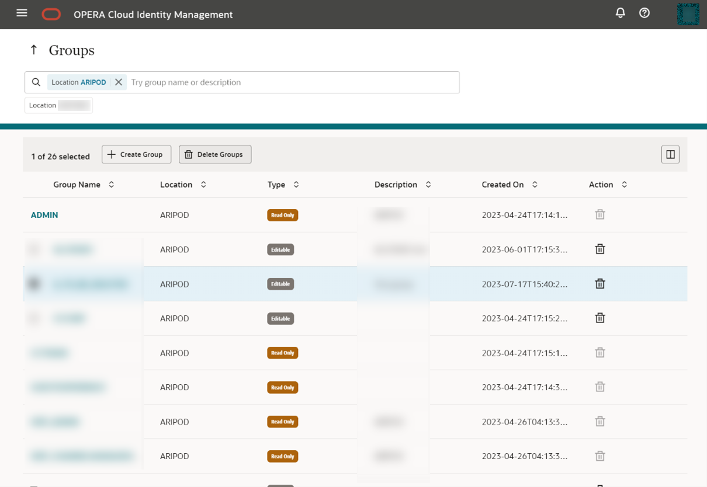

