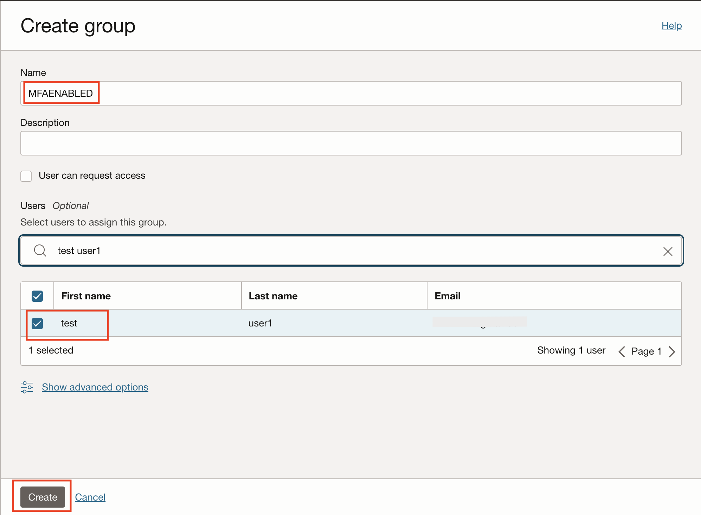
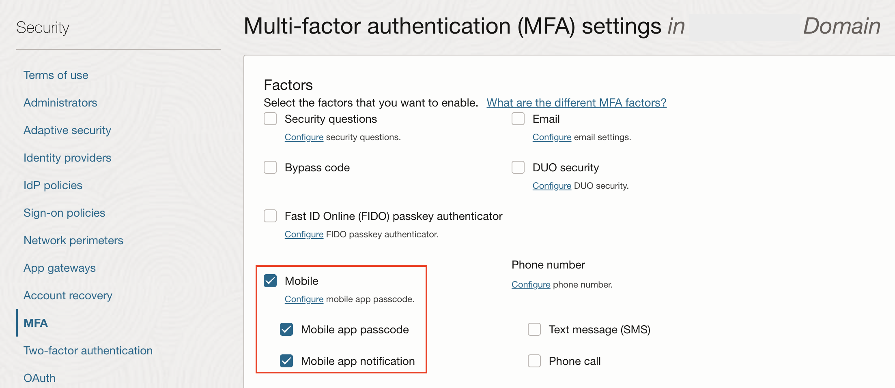
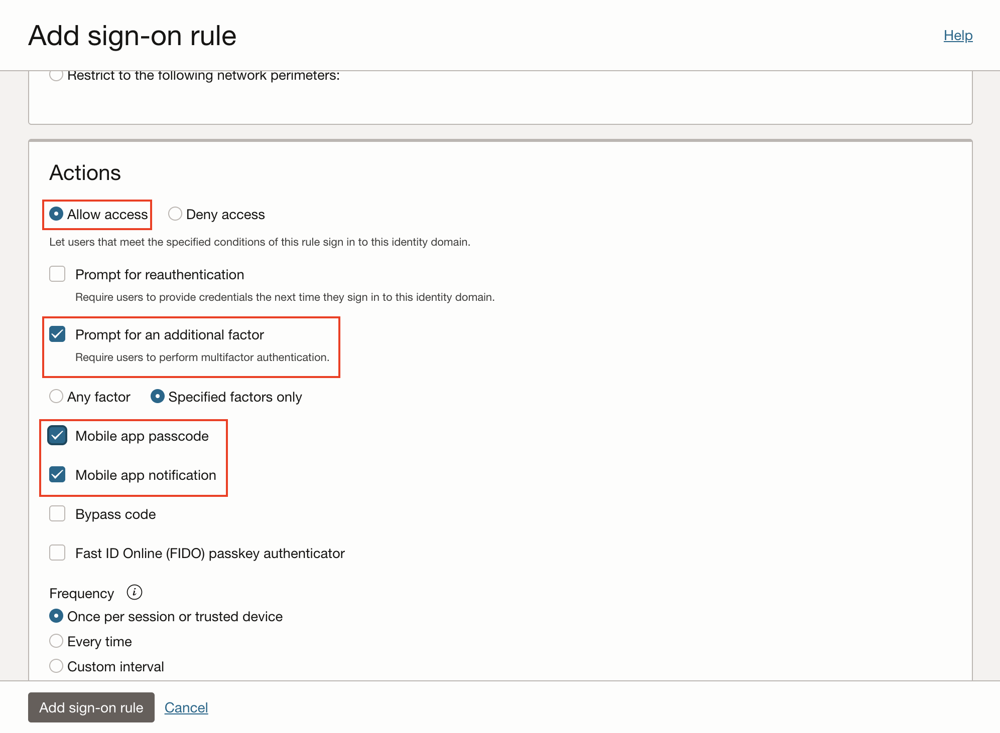
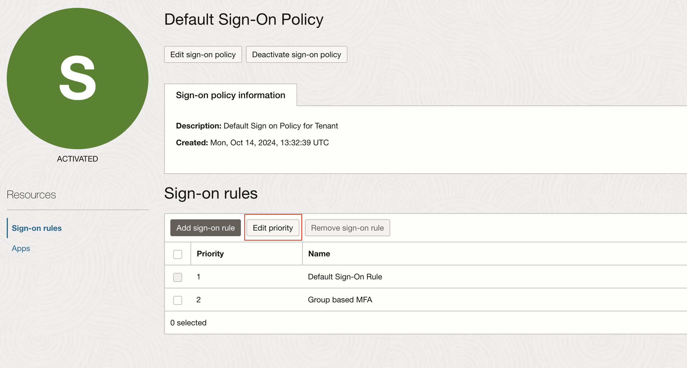

# OPERA Cloud Identity Management MFA Lab​ <!-- omit from toc -->

- [Objectives](#objectives)
- [Task 1 - Create an OCI IAM group](#task-1---create-an-oci-iam-group)
- [Task 2 - Configure MFA and Sign-on Policy](#task-2---configure-mfa-and-sign-on-policy)
- [Task 3 - Test MFA](#task-3---test-mfa)

## Objectives

The objective of this lab is to understand how to setup Multi-factor Authentication for OPERA Cloud services login.

## Task 1 - Create an OCI IAM group

1. Open a browser window and enter the following Oracle Cloud Console URL: 

    ```
    https://cloud.oracle.com
    ```
2. Enter your Cloud Account Name, also referred to as your tenancy name, and click Next.

3. Enter the login information and sign in to the OCI console. 

4. Open the navigation menu and click **Identity & Security**. Under Identity, click **Domains**.

     

3. Click the name of the identity domain in which you want to work. (You might need to change the compartment to find the domain that you want)

4. On the Domain page, click Groups


5. On the Groups page, click Create Group


6. Enter a name for the group, for example **MFAENABLED**


7. Search and Add users as members of the group for which MFA is to be triggered during OPERA Cloud services login.


8. Click Create and go back to the Domain page.

    

## Task 2 - Configure MFA and Sign-on Policy

1. On the Domain Details page, click Security.


10. On the Security page, click MFA.


11. Under Factors, you can select each of the factors required to access the identity domain. 
Here, select **Mobile App Passcode** and **Mobile App notification**.

    


16. Click Save changes, and then confirm the change.


17. Follow the below steps to configure new sign on rules to enable MFA in the default sign-on policy. This default sign-on policy will be available out of the box in a customer's OCI IAM Identity Domain.
    * On the Security page for the domain, click Sign-on policies.

    * On the Sign-on policies page, click Default Sign-On Policy.

    * On the Default Sign-On Policy page, under Resources, click Sign-on rules.

    * Click the Add sign-on rule, carefully read the confirmation, and click Continue.

    * Enter the rule name, for example, ”Group based MFA”

    * Under conditions, in Group Membership, add the group created earlier in step 6.

        

    * Under Actions, select Allow access. Select the prompt for an additional factor and select Specified factors only. Then Select the factors, we recommend Mobile app passcode and Mobile app notification

        


    * Select Once per session or trusted device under Frequency.

    * Select Required under Enrollment.

    * Click Add sign-on rule.

    * On the Default Sign-On Policy page, click Edit Priority.
    
    * Carefully read the confirmation and click Continue.

    * Click the priority number of the newly created rule to ensure it is above the Default Sign On Rule where priority 1 is the newly created rule and priority 2 is the Default Sign On Rule.

        
    
    * Click Save Changes.

## Task 3 - Test MFA

1. Login to OPERA Cloud and test MFA with the user who is part of the newly created group (the group added in the sign-on rule).