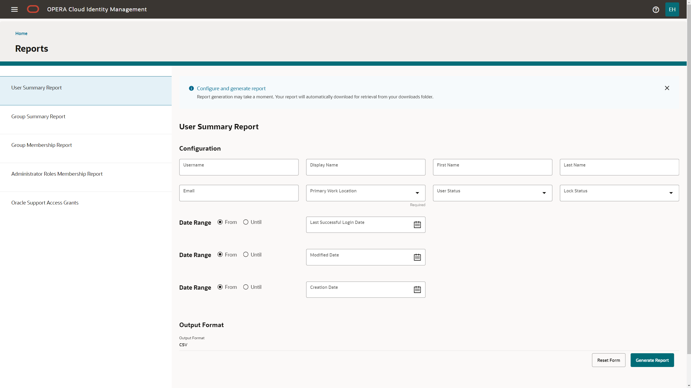

# OCIM Portal Administrator Journey – Reporting​ <!-- omit from toc -->
- [Objectives](#objectives)
- [Task 1 - Run User Summary report ​](#task-1---run-user-summary-report-)
- [Task 2 - Run Group Summary report ​](#task-2---run-group-summary-report-)
- [Task 3 - Run Group Membership Report​](#task-3---run-group-membership-report)
- [Task 4 - Run Administrator Roles Membership Report​](#task-4---run-administrator-roles-membership-report)
- [Task 5 - Run Oracle User Report](#task-5---run-oracle-user-report)

## Objectives

After completing thi lab you will learn to run and generate various reports from the OCIM portal. 

## Task 1 - Run User Summary report ​

1. Log in to OPERA Cloud Identity Management Portal as an administrator.

2. Click the Reports tile on the homepage.

    

3. To see the filter configuration page for a report, select the respective report. For example : User Summary Report

    On the right hand-side, you will see the available filter options for the selected report.

4. Add any required filter details. Optionally, you can also add additional filter criteria.

    Some filters (for example, group name filter) allow you to search for existing groups and select the groups that should be included in the report.

    

5. After you have selected a report and added filter criteria, select Generate Report to create a report.

6. Once the report generation has completed, a toast message “Report Downloaded” appears as well as the following depending on your browser:

    * A “Save As” dialogue that allows you to specify a download location for the report and save the report in that location.

    * The report being added in the “downloads” area of your browser.

    Note: All report outputs are in CSV file format and report generation may take several minutes to download or several minutes before a toast message appears on the screen for “Save As.”

## Task 2 - Run Group Summary report ​

1. Generate a Group Summary report following the same steps as above.

## Task 3 - Run Group Membership Report​

1. Generate a Group Membership report following the same steps as above.

## Task 4 - Run Administrator Roles Membership Report​

1. Generate a Administrator Roles Membership report following the same steps as above.

## Task 5 - Run Oracle User Report

1. Generate a Oracle User report following the same steps as above.