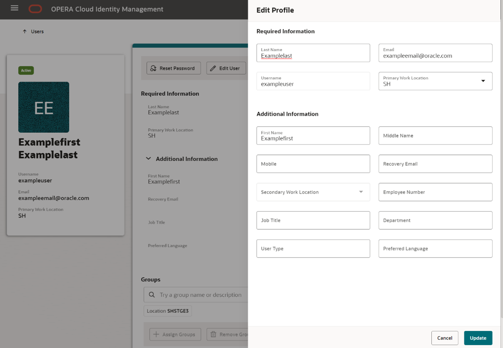

# 1. OCIM Portal End User Journey

## Login to OPERA Cloud Identity Management Portal

* [Login as Non-Federated User](#login-as-non-federated-user)

## Login as Non-Federated User

1. To login as an end user to Opera Cloud Identity Management portal as a non-Federated user, Navigate to the Opera Cloud Identity Management portal URL which follows the following pattern

    ```
    https://<OCIMHost>/<CUSTOMER ENTERPRISE ID>/ocimportal
    ```

2. On the login screen  enter your Username and Password. Click Sign In
The Opera Cloud Identity Management portal home page appears.

3. Navigate to the **My Profile** tile and click on **Manage my profile** to view your user account profile.

    The My Profile page provides a comprehensive view of a user’s details and also the user’s group memberships in OPERA Cloud Identity Management.


    

4. Click the **Change Password** button on the My Profile page to change your password.

    

5. Enter the Current Password, New Password, andConfirm Password.
The Password reset prompt screen lists the password policy and each item in the policy is selected. The user can change the password only if all the items are selected. Please adhere to the password policy when changing the password.

    

6. Click Submit to update the password to the new password. The user receives an email notification when the password is changed.

7. Sign Out of the OCIM portal

There are situations where a user forgets the user’s account password. This section provides steps for setting a new password for your user account when you forget your current password and are unable to log in to OPERA Cloud Services.

8. Open the OPERA Cloud Identity Management portal.

9. Click Forgot Password on the Login page of OPERA Cloud Identity Management portal.

10. Enter the Username in the Forgot Your Password page.
An email notification is sent to the email associated with that user account as shown in the below image.

11. Click Password Reset to set a new password for your user account.


# 2. OCIM Portal Administrator Journey – User Management

## Task 1 - Create User

1. Log in to OPERA Cloud Identity Management as an administrator.

2. Click **Users**. Click **Create User**.  

    

3. Enter the following user information. 
    * Last Name
    * Email Address
    * Username
    * Primary Work Location: This is the chain or property code representing the location where the user works.

    

4. Click **Create** to create the user.

## Task 2 - Search for a user

5. Click Locations and select the location to search for the associated users in that location.
Optionally, you can also search user(s) based on username, name or even user email address.

6. Select users from the search result and perform actions on those user(s) by clicking More Actions.

    

Alternatively, click the Action column for a user row to perform actions on that respective user.

## Task 3 - Update a User Profile

7. From the User Management page, Click **Locations** and select the location to search for the associated users in that location

8. Click on the Username of the user that you created to open the User Profile page.

9. Click Edit User to open the prompt to edit user fields.
    Adjust the editable fields as needed:
    * Last Name
    * Email Address
    * Username
    * Primary Work Location

    

10. Click Update to update the user profile.

## Task 4 - Assign ALLTASKS  or any non-admin group membership 

11. To assign an additional group to the user, select Assign Groups.

12. Search for **ALLTASKS** or **FRONTDESK** group, select the group and click the Update button in the Assign Groups drawer.

    

## Task 5 - Transfer the user to another property

During an employee or contractor transfer from one property or chain to another, OPERA Cloud Identity Management supports changing a user’s primary working location to a new location, so the new location’s administrator can manage the user.

13. On the User Profile page for a user, click More Actions and then click Edit User Primary Work Location.

    

14. Click New Primary Work Location to select the new primary work location from the list of values, which is depicted as Chain followed by its properties.

    

15. Click Current Primary Work Location Groups to view group memberships for that user associated with the current primary work location.

    

16. Click Update to update the User Primary Work Location.

## Task 6 - Assign user to IAMADMIN​ Administrator role

17. From the homepage, Click **Administrator Roles**

18. Click the Locations filter chip in the search bar and select the location.

19. Click on the **IAMADMIN** role name to display the Administrator Role  details profile page for that role.  

    

20. Click **Assign Users** to search for existing users. 

    

21. Select the user that you created and click on **Update**

22. The IAMADMIN Administrator role is now added to the user.

## Task 7 - Deactivate User

23. On the User profile page for a user, click More Actions and then click Deactivate User

24. The user is deactivated and can be activated again.

## Task 8 - Delete User

25. On the User profile page for a user, click More Actions and then click Delete User

26. Click Delete to delete the user account.

    


## Task 9 - Approve Oracle User’s data access request​

27. Log in to OPERA Cloud Identity Management portal.
In the OPERA Cloud Identity Management portal, you will see a tile for Oracle Access Requests.

28. Select the Oracle Access Requests tile.

    

29. The Oracle Access Requests screen:

    * Shows you details for all your access requests received within the last 90 days.

    * Defaults the request status filter to support requests that are in “Awaiting Approval” status.

    *  Sorts the list of requests to the longest waiting requests to show on top.

        Note:You can only act on requests in “Awaiting Approval” status.

    * Allows you to respond to one or multiple requests.

        Note:Requests not responded to within 30 days will expire and can no longer be acted on.

30. To approve an Oracle Access Request with the row level action, click the ellipsis (“…”) under the Action column.

31. Click Approve Access.

32. Confirm by clicking Approve in the “Approve Access?” dialogue.
You have successfully granted the requested support access for the selected row.

33. To approve one or multiple Oracle Access Requests with the page level action, first select the checkbox for all requests that you want to approve at the same time.

    Note:You can select up to a maximum of 20 requests at one time.

34. Click the page level Approve Access button.

35. Confirm by clicking the Approve button in the “Approve Access?” dialogue.
For the selected requests, you have successfully granted the requested support access to the selected Oracle user.

    


